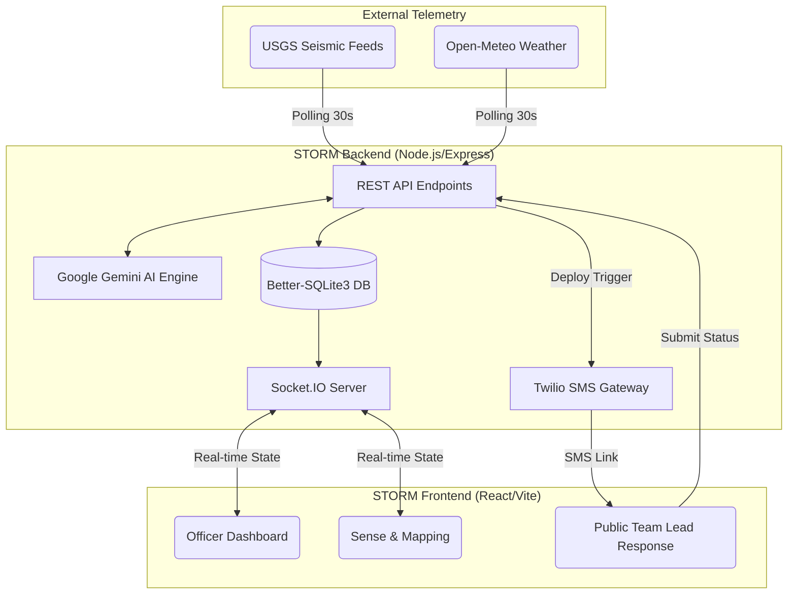

# 🌩️ STORM: Situational Tracking and Operational Response Management

   

**STORM** is a mission-critical, real-time disaster coordination and decision-support platform. It is engineered to transform chaotic, fragmented field signals—such as multi-sensor telemetry and unverified emergency reports—into a unified, actionable, and real-time operational picture.

By replacing legacy paper trails, static dashboards, and manual phone trees with a **Socket.IO-powered real-time event pipeline** and a **two-way Twilio SMS dispatch loop**, STORM massively accelerates crisis response times. It integrates live global telemetry, AI-assisted dispatch planning (powered by Google Gemini), strict officer-in-the-loop governance, and closed-loop ground unit verification.

---

## 🧭 The Core Operational Loop

The STORM architecture is designed around a five-phase, continuously executing operational loop:

1. **📡 Sense (Ingestion):** Live telemetry from USGS (seismic activity) and Open-Meteo (weather/climate data) is polled every 30 seconds.
2. **🧠 Reason (Analysis):** The Google Gemini AI evaluates the live telemetry and drafts optimized, spatial deployment recommendations mapped against available physical resources.
3. **🛡️ Act (Governance):** Duty Officers, authenticated via secure JWT tokens, review the AI recommendations and manually authorize resource deployments.
4. **📲 Respond (Dispatch):** Authorized deployments instantly trigger a Twilio SMS dispatch to the Team Lead's mobile device, containing a secure, tokenized mission briefing link.
5. **🔄 Broadcast (Synchronization):** Once the Team Lead submits their mission status via the web link, the central SQLite database is updated, and the new global state is synchronized to all active Command Hubs in under 10 milliseconds via Socket.IO.

---

## 🏗️ System Architecture



---

## 🌟 Key Features & Modules

### 📡 1. Live Global Data Telemetry (The Sense Layer)
STORM continuously ingests live telemetry across global and regional sensor streams:
- **USGS Real-Time Seismic Feed:** Polled every 30 seconds for South Asian earthquake anomalies. Raw magnitude data is programmatically translated into calibrated STORM severity zones.
- **Open-Meteo Weather Streams:** Actively monitors multi-city precipitation, wind speed, and extreme temperature data to trigger flash flood, storm, and heatwave alerts.
- **Interactive Geospatial Mapping:** A dedicated `/sense` module visualizes live anomalies using Leaflet.js, complete with severity badges, population density estimates, and smooth coordinate-centering navigation.

### 🧠 2. AI Spatial Optimization (The Reason Layer)
When a live disaster is detected, STORM offloads complex logistical routing to the **Google Gemini Engine**. 
- The AI cross-references incident severity, estimated casualties, and required equipment against the live inventory of available NDRF and medical resources.
- It drafts an optimized dispatch plan containing confidence scores, manual vs. AI ETA comparisons, and strict equipment allocations.
- **Live Telemetry Binding:** Dispatch dropdowns are dynamically populated in real-time, completely preventing the dispatch of resources to inactive or resolved zones.

### 🛡️ 3. Secure Human Governance & Auth
STORM enforces strict operational security and "human-in-the-loop" safeguards:
- **JWT Session Tokens:** Generated upon login and rigorously validated on every stateful socket action (e.g., `approve_recommendation`, `bind_resource`).
- **Cryptographic Protection:** All officer and team leader credentials are salted and hashed using `bcrypt`.
- **Protected Routing:** Operational modules are completely inaccessible without an active, verified officer session.

### 📲 4. Two-Way Twilio SMS Notification Loop
STORM closes the communication gap between Command Officers in the HQ and Field Units on the ground:
1. **Automated Dispatch:** Binding a resource to a zone triggers an SMS to the assigned Team Lead, featuring a single-use tokenized link (`/respond/{token}`).
2. **Frictionless Field Reporting:** Team Leads click the link (no app download required) to view their mission directive and submit operational status (**Completed** or **Incomplete**) along with ground observation notes.
3. **Instant HQ Sync:** Upon submission, the backend updates the SQLite database, texts a confirmation receipt back to the deploying officer, and pushes a global UI update to all dashboards.

### 🚨 5. Automated Critical-Severity Sentry
When any monitored zone reaches an extreme severity score ($\ge 8$ out of 10) for the first time:
- The system automatically blasts an urgent SMS alert to all registered duty officers.
- It emits a global `notification_broadcast` to all active browser sessions, dropping down a high-priority red alert banner.
- All alerts are deduplicated via SQLite `critical_alerts` tracking to prevent alert fatigue.

---

## 🛠️ Technology Stack

| Domain | Technologies |
| :--- | :--- |
| **Frontend Core** | React 18, Vite 6, React Router 6 |
| **Styling & UI** | Tailwind CSS v4, Lucide React (Icons) |
| **Geospatial Mapping** | Leaflet, React-Leaflet |
| **Real-Time Sync** | Socket.IO-Client |
| **Backend Core** | Node.js, Express 5 |
| **Database** | Better-SQLite3 (Synchronous WAL Mode) |
| **Authentication** | JSONWebToken (JWT), Bcrypt |
| **External Integrations** | Twilio SDK (SMS), Google GenAI SDK (LLM), Axios (Telemetry) |

---

## 🚀 Getting Started

Follow these instructions to spin up a local development instance of the STORM platform.

### Prerequisites
- **Node.js** (v18.0.0 or higher)
- **NPM** (v9.0.0 or higher)
- *(Optional)* **Google Gemini API Key** for LLM dispatch recommendations.
- *(Optional)* **Twilio Account** for live SMS dispatches. (If omitted, STORM falls back to simulating SMS deliveries in the terminal console).

### 1. Backend Setup

Open a terminal and navigate to the backend directory:
```bash
cd server
npm install
```

Create a `.env` file in the `server` directory by copying the example file (or use the template below):
```env
PORT=3001
VITE_API_URL=http://localhost:3001
APP_URL=http://localhost:3000
JWT_SECRET=storm_production_jwt_secret_key_change_in_prod

# Google Gemini API
GEMINI_API_KEY=your_gemini_api_key_here

# Twilio SMS (Optional)
TWILIO_ACCOUNT_SID=your_twilio_account_sid
TWILIO_AUTH_TOKEN=your_twilio_auth_token
TWILIO_FROM_NUMBER=+15005550006
```

Start the backend server:
```bash
node index.js
```
> **Note:** On its first run, the backend automatically initializes the `storm.db` SQLite database, executes all necessary schema migrations, seeds the demo accounts, and begins the 30-second live telemetry polling cycle.

### 2. Frontend Setup

Open a *new* terminal window at the root of the project:
```bash
npm install
npm run dev
```
Navigate to `http://localhost:3000` in your web browser.

---

## 🔑 Demo Accounts for Testing

STORM comes pre-seeded with specialized testing accounts.

### Command Officers (HQ Dashboard)
Log in via the **Officer Login** button in the top navigation bar.

| Officer ID | Password | Rank | Contact Phone |
|---|---|---|---|
| `OFF-101` | `officer101` | SDMA Relief Commissioner | `+91██████████` |
| `OFF-102` | `officer102` | NDMA Operations Chief | `+91██████████` |
| `OFF-103` | `officer103` | NDRF Sector Commander | `+91██████████` |

### Ground Team Leaders (Unit Console)
Log in via the **Team Lead** button or directly at `/team-login`.

| Leader ID | Password | Unit / Team Name | Contact Phone |
|---|---|---|---|
| `TL-201` | `leader201` | Medical Team Alpha | `+91██████████` |
| `TL-202` | `leader202` | NDRF Boat Unit 3 | `+91██████████` |
| `TL-203` | `leader203` | Relief Kit Stock | `+91██████████` |
| `TL-204` | `leader204` | Medical Team Beta | `+91██████████` |

---

## 📂 Repository Layout

```text
STORM/
├── server/
│   ├── index.js               # Express Server, Socket.IO, Twilio SMS, Telemetry Polling
│   ├── db.js                  # SQLite Schema & ORM logic
│   ├── package.json           # Backend dependencies
│   └── .env                   # Configuration & API Keys
├── src/
│   ├── App.jsx                # Global Router & Layout Management
│   ├── context/
│   │   └── AppContext.jsx     # Global Authentication State & Session Management
│   ├── hooks/
│   │   └── useApp.js          # Extracted React hook for Fast Refresh compliance
│   ├── components/            # Reusable UI elements (Navbar, Modals, Toasts)
│   ├── pages/                 
│   │   ├── Dashboard.jsx      # Command Center & Payload Validation
│   │   ├── Reason.jsx         # AI Dispatch Planning UI
│   │   ├── Resources.jsx      # Resource Management & Binding
│   │   ├── Sense.jsx          # Live Geospatial Map & Sensor Dashboard
│   │   ├── Report.jsx         # Field Observer Intake Form
│   │   ├── Respond.jsx        # Public Two-Way SMS Response Portal (/respond/:token)
│   │   ├── TeamDashboard.jsx  # Ground Unit Operational Console
│   │   └── Home.jsx           # Public Landing Page
│   ├── index.css              # Custom Tailwind directives & Glow Aesthetics
│   └── services/                  
│       └── socket.js          # Socket.IO Client Configuration
├── index.html                 # Vite HTML entry point
└── vite.config.js             # Vite build configuration
```

---

## 🛑 Production Deployment Guidelines & Hardening

If deploying STORM to a production environment (e.g., AWS, GCP, Vercel/Render), follow these security and scaling protocols:

1. **Environment Secrets:** Never commit `.env` files. Store `JWT_SECRET`, `GEMINI_API_KEY`, and Twilio credentials securely in a managed Key Vault or Secrets Manager.
2. **CORS & Domain Whitelisting:** Update the `APP_URL` and the Socket.IO CORS configuration in `server/index.js` to strictly point to your production domains.
3. **Storage Offloading:** Connect AWS S3 or GCP Cloud Storage for binary file uploads (currently, field report images are managed locally).
4. **Horizontal Scaling:** Because Socket.IO relies on state, if deploying across multiple backend instances behind a load balancer, you **must** configure a Redis adapter for Socket.IO and migrate the SQLite database to a centralized PostgreSQL instance.
5. **Rate Limiting:** Implement `express-rate-limit` on all public `/api/reports` and `/api/inquiries` endpoints to prevent malicious spamming of the SQLite database.

---
*Built with precision for the next generation of crisis response.*
